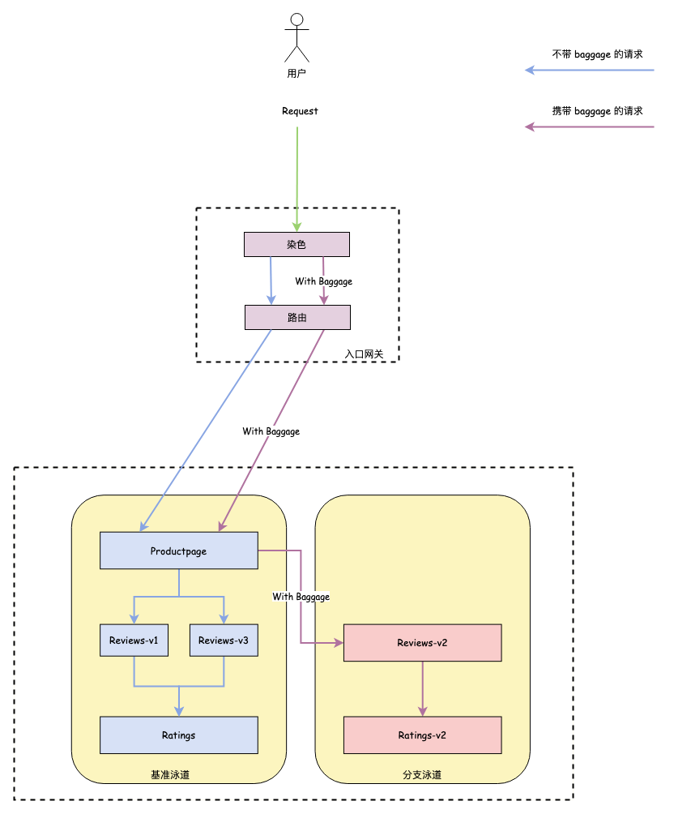
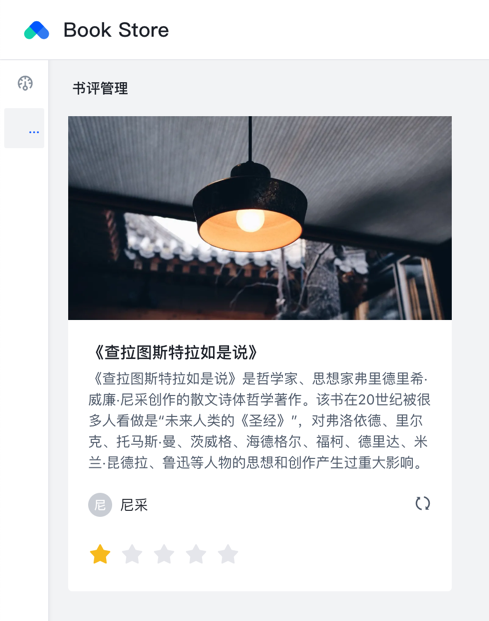
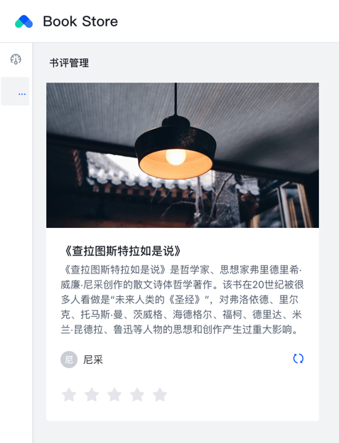
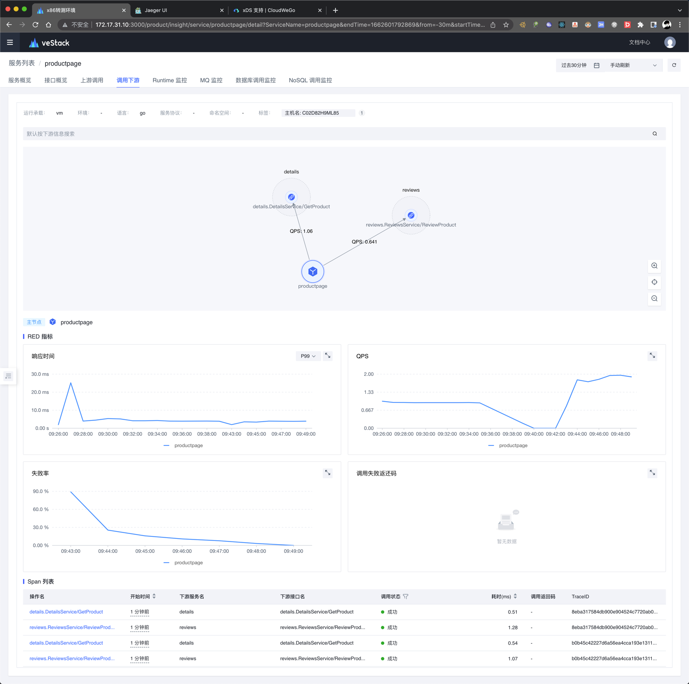

# Bookinfo

> Rewrite **[Bookinfo](https://istio.io/latest/en/docs/examples/bookinfo/)** project using `hertz`, `kitex`

## Architecture


## Lane


## Traffic routing example

#### Define routing rules

```yaml
apiVersion: networking.istio.io/v1alpha3
kind: VirtualService
metadata:
  name: reviews
spec:
  hosts:
    - reviews
  http:
    - match:
        - headers:
            baggage:
              exact: "env=dev"
      route:
        - destination:
            host: reviews
            subset: v2
          weight: 100
    - route:
        - destination:
            host: reviews
            subset: v1
          weight: 80
        - destination:
            host: reviews
            subset: v3
          weight: 20

---

apiVersion: networking.istio.io/v1alpha3
kind: VirtualService
metadata:
  name: ratings
spec:
  hosts:
    - ratings
  http:
    - match:
        - headers:
            baggage:
              exact: "env=dev"
      route:
        - destination:
            host: ratings
            subset: v2
          weight: 100
    - route:
        - destination:
            host: ratings
            subset: v1
          weight: 100
```

#### Request base lane service, rating `0` or `1` randomly



#### Set the request coloring flag through the browser mod-header plugin


#### Click the refresh button again, you can find that the request hits the branch lane, and the rating becomes `5`


### View Tracing


### View Topology

